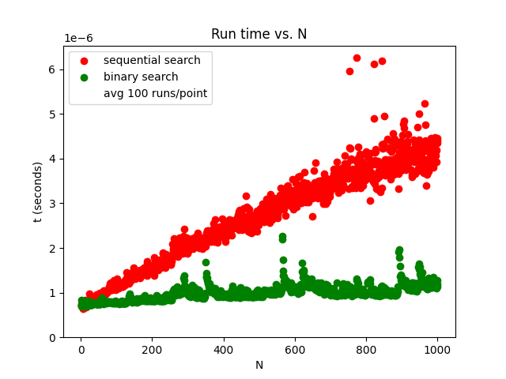
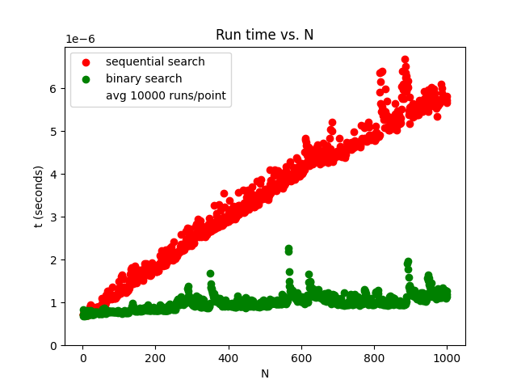
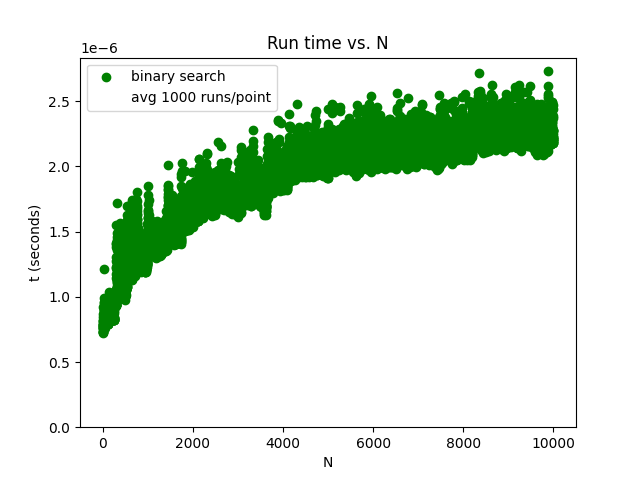
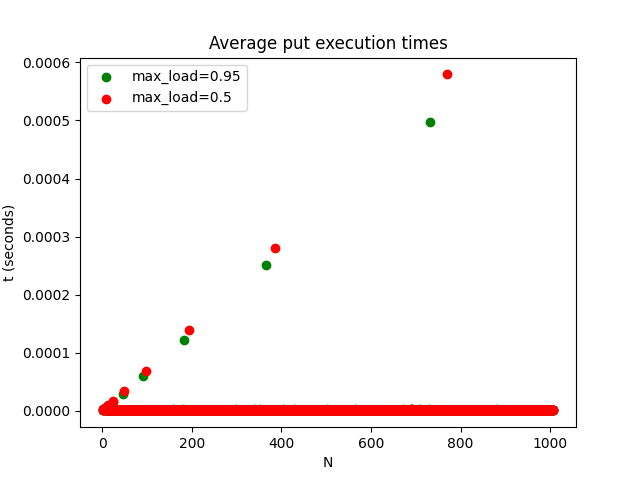

---
header-includes:
  - "\\usepackage{amsmath}"
  - "\\usepackage{graphicx}"
---

<!--

pandoc --filter pandoc-crossref hw4_answers.md -o hw4_answers.pdf --pdf-engine=xelatex

To use pandoc-crossref, make sure that you have installed pandoc-crossref.
In MacOS, this can be achieved using

  brew install pandoc-crossref


-->


# Homework 4 Answers

Due: November 9, 11:59 PM

I provide an implementation.  Your implementations may differ.

<!--
This was written using markdown and can be compiled into a pdf using

```
    pandoc hw4_answers.md -o hw4_answers.pdf --pdf-engine=xelatex
```
-->

### Problem 1

Chapter 5: Write a recursive function to compute the Fibonacci
sequence. How does the performance of the recursive function compare
to that of an iterative version?

The answer MUST have the followig form:

```
  def fibo(n) -> list:
      """Returns a list wherein the ith member is the ith number in the
      Fibonnaci sequence"""
```


### Answer Problem 1

The Fibonacci sequence is the sequence of numbers wherein each number
is equal to the sum of the previous two numbers with the base cases
being that the first two numbers in the sequence are 0 and 1.

\[
  0, 1, 1, 2, 3, 5, 8, 13, ...
\]

Below is an example acceptable recursive implementation:

```
    def fibo_recurse(n : int) -> list:
        """
        Create a list containing the Fibonacci numbers from 0 to and
        including n.  $F_0=0, F_1=1, F_n=F_{n-1}+F_{n-2}$.
        
        :param n: sequence contains up to and includeing $F_n$. 
        :return: the sequence as a list.
        """
        def _recurse(n : int) -> int:
            if n == 0:
                return 0
            elif n == 1:
                return 1
            return _recurse(n-1) + _recurse(n-2)
    
        if n < 0:
            raise  ValueError
        x = []
        for i in range(0, n+1):
            x.append(_recurse(i))
        return x
```

Below is an example iterative implementation:

```
    def fibo_iterative(n: int) -> list:
        if n < 0:
            raise ValueError
        elif n == 0:
            return [0]
        elif n == 1:
            return [0, 1]
        x = [0, 1]
        for i in range(2, n+1):
            x.append(x[i-2] + x[i-1])
        return x
```

The two code snippets above can be found in the source code
repository at `csci-356/hw4/p1`.


### Problem 2

Section 5.17 Problem 11.  Write a program that solves the following
problem: Three missionaries and three cannibals come to a river and
find a boat that holds two people. Everyone must get across the river
to continue on the journey. However, if the cannibals ever outnumber
the missionaries on either bank, the missionaries will be eaten. Find
a series of crossings that will get everyone safely to the other side
of the river.

Note: the solution must be recursive.  The solution must output using
the following form:

```
    Near to far with X cannibals and Y missionaries.
    Far to near with X cannibals and Y missionaries.
    ...
```

where $X$ is the number of cannibals in the boat, and $Y$ is the number
of missionaries.   There should be no extraneous output.

### Answer Problem 2

Let's start by thinking about the problem for the 1 cannibal and 1
missionary case.  This is trivial both get in the boat and cross.
Only one crossing is required.

The problem becomes slightly harder with 2 cannibals and 2 missionaries.
Let $m$ denote a missionary and $c$ denote a cannibal. 

{#fig:p2_feast}

@fig:p2_feast shows what happens when do not take sufficient care.
The algorithm we write to solve this puzzle must maintain the
constraint that there can never be more cannibals than missionaries
are either side after a crossing.

{#fig:p2_success}

@fig:p2_success avoids the problem shown in @fig:p2_feast by sending over
two missionaries on the third one-way crossing (i.e., first leg of the
second round-trip).

For the two missionaries and two cannibals case, there exists several
solutions, we can replace the first two crossings in @fig:p2_success with

 1. cc crosses leaving mm on the near bank.
 2. c returns leaving c on the far bank and mmc on the near bank.

At this point it becomes the same as the last three crossings as appear
in @fig:p2_success.

Alternatively the last two crossings in @fig:p2_success could be
replaced with

 4. c crosses leaving mm on the far bank and cc on the near bank.
 5. cc crosses arriving with everyone on the far bank.

When we consider 3 missionaries and 3 cannibals, the problem becomes
a bit harder.  In the solutions to 2 missionaries and 2 cannibals
we always sent 2 people from near bank to far bank and always returned
with 1.  Does this 2 go and 1 return constraint work with the 3
missionaries and 3 cannibals problem?

In the first 3 one-way crossing (i.e., second trip from
the near to the far bank),

 1. If we send $cm$ then $ccmm$ remain on the near bank and $cm$ on the far.
 2. only $m$ can come back because sending $c$ results in a FEAST.
    we now haver $ccmmm$ on the near bank and $c$ on the far.
 3. If we send $mm$ then $ccm$ remain on the near bank resulting in a feast.
    If we send $cm$ then $cmm$ remain on the near but $ccm$ occurs on the far
    resulting in a feast.  If however, we send $cc$ then $mmm$ remain on the
    near bank and $ccc$ on the far bank.
 4. If $c$ returns then we have $cmmm$ on the near bank and $cc$ on the far
    bank.
 5. Send $mm$ and we have $cm$ on the near bank $ccmm$ on the far bank.
 6. If $c$ returns. $ccm$ on the near bank, FEAST.
    $m$ returns. $ccm$ on the far bank, FEAST.
    Uh-oh.

There is no way forward by sending $cm$ or $mm$ on the first crossing.  Only
$cc$ might work.

  1. Send $cc$ then $cmmm$ on near and $cc$ on far.
  2. $c$ returns then $ccmmm$ on near and $c$ on far.
  3. If send $cc$ then $mmm$ on near and $ccc$ on far.
  4. $c$ returns then $cmmm$ on near and $cc$ on far.
  5. Send $mm$ then $cm$ on near and $ccmm$ on far.

Uh-oh.  The same situation arises. If $c$ returns then we have a feast
on near bank.  If $m$ returns then we have a feast on the far bank!

If appears as if there is no solution, except we avoided one possibility.
What if we allow more than one to return?

However, if we allow more than one to return then it looks like an
infinite recursion could take place.   One way to avoid the infinite
recursion is to keep a set of already visited states and prevent
repeating any state that we have already visited.

I did exactly that in my missionaries solution.  I present a subset of the
solution here:

```
    def cross_river(missionaries:int, cannibals:int) -> list|None:
        already_considered = set()

        def near(near_m, near_c, far_m, far_c) -> list|None:
            if near_c > near_m > 0 or far_c > far_m > 0:
                return None
            if (near_c, near_m, far_c, far_m) in already_considered:
                return None
            elif near_c == 0 and near_m == 0:
                return []
            already_considered.add((near_c, near_m, far_c, far_m))

            if near_m > 0 and near_c > 0:
                x = far(near_m - 1, near_c - 1, far_m + 1, far_c + 1)
                if x is not None:
                    x.append((1, 1))
                    return x
            
            if near_m > 1:
                x = far(near_m - 2, near_c, far_m + 2, far_c)
                if x is not None:
                    x.append((2, 0))
                    return x
            ...

        def far(near_m, near_c, far_m, far_c) -> list|None:
            if near_c > near_m > 0 or far_c > far_m > 0:
                return None
            elif near_c == 0 and near_m == 0:
                return []
            ...

        x = near(missionaries, cannibals, 0, 0)
        return list(reversed(x))
```

I omit some of the cases because the code is a little verbose to list here.
`near_c` and `near_m` denote the number of cannibals and missionaries
respectively on the near bank.  `far_c` and `far_m` denote the number
of cannibals and missionaries respectively on the far bank.

The full code can be found in the source code repositoru at

```
    csci-356/hw4/p2/missionaries.py
```

For your code to be accepted as correct, it must generate output that
never violates the constraint that the number of cannibals is not allowed
to ever exceed the number of missionaries on either bank.  I found at
least two solutions.


### Problem 3

Section 6.16 Problem 1

Set up a random experiment to test the difference between a sequential
search and a binary search on a list of integers.

Vary the size of the list of integers $n$ from 1 to 1000.  Repeat the
experiment $m$ times for each $n$ and take the average run time per
call, where $m=100$.  Output the average run times in a plot where the x-axis
is $n$ and the y-axis is the average run time per search.

### Answer Problem 3

Your plots should look something like the plot in @fig:p3_seq_bin_v_n.

{#fig:p3_seq_bin_v_n}

The problem asks for $m=100$ which results in significant variability and
the plot looks like there could be a slight sublinearity.  Although not
required for the problem a larger $m=10000$ yields somewhat smoother curves.

{#fig:p3_seq_bin_m10000_v_n}

In neither plots shown in @fig:p3_seq_bin_v_n or
@fig:p3_seq_bin_m10000_v_n is it obvious the shape of the curve for
binary search because it is so flat.  To better reveal the shape the
curve of binary search run time vs. n, I zoomed in the y-axis.  The
resulting figure (see @fig:p3_binary_m10000_v_n) does yield a more
logarithmic looking curve of run time vs. n for binary search.

{#fig:p3_binary_m10000_v_n}

The code to generate this output can be found in

```
    csci-356/hw4/p3/sequential_vs_binary.py
```

### Problem 4

Section 6.16 Problem 7

In the hash table map implementation, the hash table size was chosen
to be 101. If the table gets full, this needs to be
increased. Re-implement the put method so that the table will
automatically resize itself when the loading factor reaches a
predetermined value.

Modification: Double the size each time the load factor reaches
a predetermined value.  Plot the average run-time per call as a function of
$n$ showing the difference in performance when you allow the hash table
to resize when it reaches a load factor of 0.5 vs. a load factor of 0.95.

### Answer Problem 4

First I added length and maximum load factor data members.  Both
are necessary to determining when to grow the capacity of the list
that stores the hash table.

$\text{load factor} = \frac{\text{length}}{\text{capacity}}$

I modified the \verb|__init__| method as follows:


    def __init__(self, capacity: int = 11, max_load: float = 0.5):
        self._capacity = capacity
        ...
        self._max_load = max_load
        self._len = 0


I added a `_grow` method to the hash table:

    def _grow(self):
        self._capacity *= 2
        slots = self._slots
        self._slots = [None] * self._capacity
        data = self._data
        self._data = [None] * self._capacity

        for i in range(len(slots)):
            if slots[i] is not None:
                self.put(slots[i], data[i])

Then in `put` call `grow` when the `max_load` factor is exceeded. 

    def put(self, key, data):
        self._len += 1
        load = float(self._len) / self._capacity
        if load > self._max_load:
            self._grow()
        ...

The code for the entire solution can be found in the repository
at

    hw4/p4/hash_table.py

I first plotted using the default automatic scaling of the y-axis as shown
in the following figure.

{#fig:p4_hash_put_vs_n}

We can see in @fig:p4_hash_put_vs_n spikes in the run time
where the underlying table is grown.  The time of growing the hash
table causes the y-axis to scale so broadly that it becomes hard to
see whether running with a maximum load factor of 0.5 or 0.95 results
in significantly worse performance when not growing, so I zoomed in on
the y-axis to clip out the jumps in execution time due to the few
puts that resulted in growing the hash tables.  

{#fig:p4_hash_put_zoom_vs_n}

Zooming in reveals that we see larger put execution times when we
allow the `max_load` to reach 0.95 as compared to 0.5.

